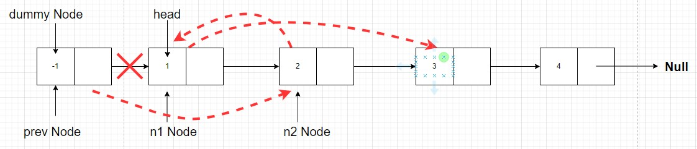
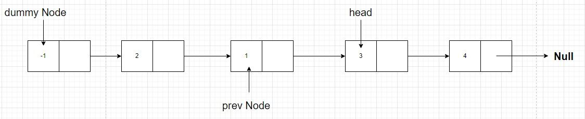

---
layout: post
title: LeetCode 24 Swap nodes in pairs 
tags:
- algorithm 
excerpt: All about leetCode 24 Swap Nodes in Pairs
---

### the question describe

The question is Given a linked list, swap every two adjacent nodes and return its head. You must solve the problem without modifying the values in the list's nodes (i.e., only nodes themselves may be changed.)

LeetCode will give you a link, you need swap it exactly, like follow pic


### Let's understand the **approach**

1. First, we will place a `dummy node` before a `head node` so that the code we write can be applicable to the head node also, and we don't have to specifically write different conditions for the head node.


2. Now, let the head be our `n1 node` and next be `n2 node`, that means `node with value 1` is `n1` and `node with value 2` is `n2`, and we have to swap `n1` and `n2`. So for this, we will also have to keep track of the node previous to `n1 node`, let it be `prev`, as it's next pointer value will have to change after we swap the `n1 node` and `n2 node`
   

3. Now the very first thing to do is change the `next pointer of prev node to point to n2 node`. Why?? Because in the answer we want the `n2 node after dummy node`. Right? So we will have to connect `dummy node`(now is prev node) to the `node with value 2`(`n2 node`). The means
```javascript
prev.next = n2
```


4. Now in our final answer the `node with value 1` should be at the place of `node with value 2`. So the next pointer of `node with value 1` should point to whatever the `node with value 2` is pointing to originally. That means we will have to change `n1 next` to `n2 next`
```javascript
n1.next = n2.next
```     


5. Now as in the answer the `node with value 2` should point to `node with value 1`. That means
```javascript
n2.next = n1
```


6. After this iteration, Nodes 1 and 2 will get swapped and our linked list will look like this
	

7. Now for the next iteration, we have to swap `node with values 3 and 4`. For that the `prev node` should point to `node with value 1` and the `head node` should point to `node with value 3`. This means
```javascript
prev = n1
head = n1.next
```


8. We should stop this procedure when either there is no nodes left to swap or there is only one node left which cannot be swapped with any node.
9. At the end, as we can see that our head of the list has been misplaced in the procedure of swapping, so we can return `dummy.next` to return the swapped linked list.
 
### code
```javascript
var swapPairs = function(head) {
    // build a dummy nodes link to head, like [-1,1,2,3,4]
    let dummy = new ListNode(-1)
    dummy.next = head
    // assign dummy to prev because prev will change to  forward nodes, but dummy always link to first node, in this example is link to [2...]
    let prev = dummy
    
    // loop when head and head.next is not null
    while(head && head.next) {
        // cur node
        let n1 = head
        // next node
        let n2 = head.next
        
        // link to next node, first time is [2...]
        prev.next = n2 
        // swap
        n1.next = n2.next
        n2.next = n1

        // make prev move to forward node for next loop use, for example, first time prev assign to n1, when next loop prev.next like n1.next [1,3,4]
        prev = n1 
        // change head is n1.next
        head = n1.next
    }

    return dummy.next
};
```

Complexity:
TC = O(n)
SC = O(1)
### reference
[24. Swap Nodes in Pairs](https://leetcode.com/problems/swap-nodes-in-pairs/)