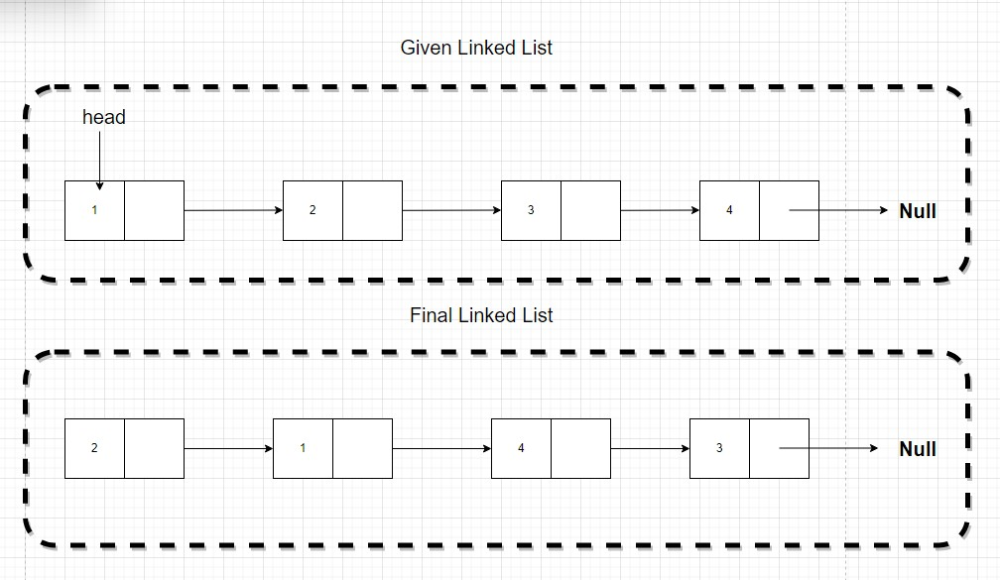

---
layout: post
title: LeetCode 24 Swap nodes in pairs 
tags:
- algorithm 
excerpt: All about leetCode 24 Swap Nodes in Pairs
---

The question is Given a linked list, swap every two adjacent nodes and return its head. You must solve the problem without modifying the values in the list's nodes (i.e., only nodes themselves may be changed.)

